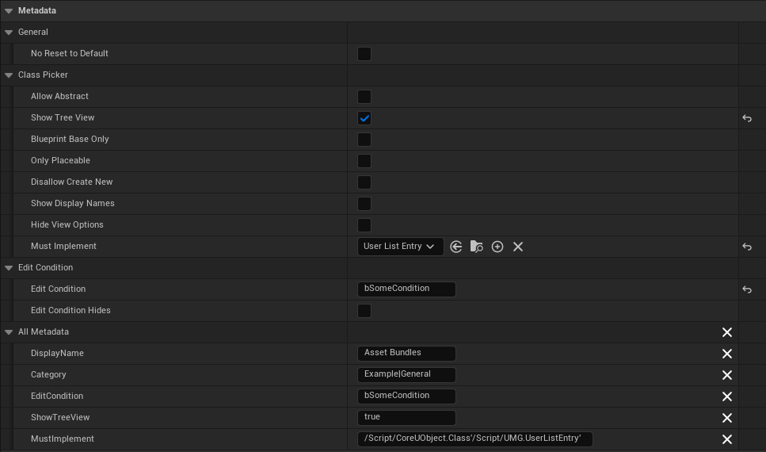

#  Neat Metadata
Editor extension to allow various metadata to be used in Blueprints that is otherwise only available in C++.

## Examples
|                                            |
|:-------------------------------------------|
| Class Picker                               |
|  |
| Get Options                                |
|         |
| Gameplay Tags                              |
|  |

## Supported Metadata
<table>
  <tr><th colspan="3">General</th></tr>
  <tr><th>Metadata</th><th>Type</th><th>Description</th></tr>

  <tr><td><code>Categories</code></td>  <td><code>GameplayTag</code></td>  <td>The root gameplay tag that can be selected.</td></tr>
  <tr><td><code>AssetBundles</code></td><td><code>SoftObjectReference</code> <code>SoftClassReference</code></td><td>Determines what asset bundles to put the object reference in. See <a href="https://docs.unrealengine.com/5.1/en-US/asset-management-in-unreal-engine/#assetbundles">Asset Manager documentation</a> for more details.</td></tr>
  <tr><td><code>AllowedTypes</code></td><td><code>PrimaryAssetId</code></td><td>Determines what <code>PrimaryAssetType</code>s are allowed to be selected.</td></tr>
  <tr><td><code>HideAlphaChannel</code></td><td><code>Color</code> <code>LinearColor</code></td><td>Don't show the alpha channel in the widget.</td></tr>
  <tr><td><code>ShowOnlyInnerProperties</code></td><td>Most structs</td><td>Removes the parent scope around a struct property and displays all of its properties inline.</td></tr>
  <tr><td><code>NoResetToDefault</code></td><td>Any</td><td>Removes the "Reset To Default" button from this property.</td></tr>
  <tr><td><code>AllowPreserveRatio</code></td><td><code>Vector</code> <code>Vector2D</code> <code>Vector4</code> <code>Rotator</code></td><td>If enabled, shows the preserve aspect ratio button on this property.</td></tr>
  <tr><td><code>RowType</code></td><td><code>DataTableRowHandle</code></td><td>The type of struct that can be specified for a data table.</td></tr>

  <tr><th colspan="3">Edit Conditions</th></tr>
  <tr><th>Metadata</th><th>Type</th><th>Description</th></tr>

  <tr><td><code>EditCondition</code></td><td>Any</td><td>Disable editing of the variable based on some condition.</td></tr>
  <tr><td><code>EditConditionHides</code></td><td>Any</td><td>Hides a property if it doesn't match the above condition.</td></tr>
  <tr><td><code>InlineEditConditionToggle</code></td><td><code>bool</code></td><td>Display the checkbox used as edit condition on the same row as the property.</td></tr>
  <tr><td><code>HideEditConditionToggle</code></td><td>Any</td><td>Hide the inline checkbox on this property.</td></tr>

  <tr><th colspan="3">Numeric</th></tr>
  <tr><th>Metadata</th><th>Type</th><th>Description</th></tr>

  <tr><td><code>Units</code></td><td><code>Float</code> <code>Integer</code> <code>Integer64</code> <code>Byte</code></td><td>Choose what unit a property represents. (Meters, centimeters, degrees, bytes, etc.)</td></tr>
  <tr><td><code>ForceUnits</code></td><td><code>Float</code> <code>Integer</code> <code>Integer64</code> <code>Byte</code></td><td>Force the property widget to display a certain unit, regardless of user preferences.</td></tr>
  <tr><td><code>NoSpinbox</code></td><td><code>Float</code> <code>Integer</code> <code>Integer64</code> <code>Byte</code></td><td>If true, removes the possibility to drag the widget. The user is then only allowed to write values into the box.</td></tr>
  <tr><td><code>SliderExponent</code></td><td><code>Float</code> <code>Integer</code> <code>Integer64</code> <code>Byte</code></td><td>Use exponential scale for the slider.</td></tr>
  <tr><td><code>Delta</code></td><td><code>Float</code> <code>Integer</code> <code>Integer64</code> <code>Byte</code></td><td>Delta to increment the value as the slider moves. If not specified it will be determined by the spin box.</td></tr>
  <tr><td><code>LinearDeltaSensitivity</code></td><td><code>Float</code> <code>Integer</code> <code>Integer64</code> <code>Byte</code></td><td>If we're an unbounded spin box, what value do we divide mouse movement by before multiplying by Delta. Requires Delta to be set.</td></tr>
  <tr><td><code>WheelStep</code></td><td><code>Float</code> <code>Integer</code> <code>Integer64</code> <code>Byte</code></td><td>How much to increment this value when the user is scrolling with their mouse wheel.</td></tr>
  <tr><td><code>Multiple</code></td><td><code>Float</code> <code>Integer</code> <code>Integer64</code> <code>Byte</code></td><td>This property is only allowed to be a multiple of this value. Value will be floored to the closest multiple.</td></tr>
  <tr><td><code>ArrayClamp</code></td><td><code>Float</code> <code>Integer</code> <code>Integer64</code> <code>Byte</code></td><td>The name of an array property that this property will be clamped to.</td></tr>

  <tr><th colspan="3">Text</th></tr>
  <tr><th>Metadata</th><th>Type</th><th>Description</th></tr>

  <tr><td><code>GetOptions</code></td><td><code>String</code> <code>Name</code></td><td>Create a dropdown of possible values that are allowed to be selected.</td></tr>
  <tr><td><code>PasswordField</code></td><td><code>String</code> <code>Name</code> <code>Text</code></td><td>Indicates that this field represents a password, and will be displayed using asterisks (*).</td></tr>
  <tr><td><code>MaxLength</code></td><td><code>String</code> <code>Name</code> <code>Text</code></td><td>The maximum number of characters that are allowed.</td></tr>
  
  <tr><th colspan="3">Directory Path</th></tr>
  <tr><th>Metadata</th><th>Type</th><th>Description</th></tr>

  <tr><td><code>RelativePath</code></td><td><code>DirectoryPath</code></td><td>Should the path be relative to the engine directory. By default the path is absolute.</td></tr>
  <tr><td><code>ContentDir</code></td><td><code>DirectoryPath</code></td><td>Should the path be relative to ContentDir, in this format: "/Game/Path/To/Dir". Uses a custom widget that only shows content paths.</td></tr>
  <tr><td><code>RelativeToGameContentDir</code></td><td><code>DirectoryPath</code></td><td>Should the path be relative to the game directory, i.e. for "Content/Path/To/Dir" it returns "Path/To/Dir". The path must be inside the game directory.</td></tr>

  <tr><th colspan="3">File Path</th></tr>
  <tr><th>Metadata</th><th>Type</th><th>Description</th></tr>

  <tr><td><code>LongPackageName</code></td><td><code>FilePath</code></td><td>Should the path be a LongPackageName, i.e. "/Game/Path/To/File"? Otherwise the path will be relative to engine directory.</td></tr>
  <tr><td><code>RelativeToGameDir</code></td><td><code>FilePath</code></td><td>Should the path be relative to the game directory, i.e. "Content/Path/To/File.extension"? Otherwise the path will be relative to engine directory.</td></tr>
  <tr><td><code>FilePathFilter</code></td><td><code>FilePath</code></td><td>Describes what file types should show up in the file picker.</td></tr>

  <tr><th colspan="3">Asset Picker</th></tr>
  <tr><th>Metadata</th><th>Type</th><th>Description</th></tr>

  <tr><td><code>RequiredAssetDataTags</code></td><td><code>Object</code> <code>Soft Object</code></td><td>Asset registry metadata tags that are required to exist in order to show the asset. This can be very useful on vast amount of properties.</td></tr>
  <tr><td><code>DisallowedAssetDataTags</code></td><td><code>Object</code> <code>Soft Object</code></td><td>The opposite of RequiredAssetDataTags. Asset registry metadata tags that are NOT allowed to be present on the asset.</td></tr>
  <tr><td><code>ForceShowEngineContent</code></td><td><code>Object</code> <code>Soft Object</code></td><td>Whether to force engine content to be visible in the editor regardless of the user's current settings.</td></tr>
  <tr><td><code>ForceShowPluginContent</code></td><td><code>Object</code> <code>Soft Object</code></td><td>Whether to force plugin content to be visible in the editor regardless of the user's current settings.</td></tr>
  <tr><td><code>ExactClass</code></td><td><code>Object</code> <code>Soft Object</code></td><td>Whether the user is only allowed to select the exact allowed classes.</td></tr>
  <tr><td><code>AllowedClasses</code></td><td><code>Object</code> <code>Soft Object</code></td><td>Classes that are allowed to be selected. Mostly useful on Object properties where you may want both Materials and Textures to be selectable.</td></tr>
  <tr><td><code>DisallowedClasses</code></td><td><code>Object</code> <code>Soft Object</code></td><td>Classes that are not allowed to be displayed. Say you want to display all Textures, except for TextureLightProfiles. Then you'd specify TextureLightProfile here.</td></tr>

  <tr><th colspan="3">Class Picker</th></tr>
  <tr><th>Metadata</th><th>Type</th><th>Description</th></tr>

  <tr><td><code>AllowAbstract</code></td><td><code>Class</code> <code>Soft Class</code></td><td>Whether to allow abstract classes to be selected.</td></tr>
  <tr><td><code>ShowTreeView</code></td><td><code>Class</code> <code>Soft Class</code></td><td>Whether to show the classes in a tree view or a list view.</td></tr>
  <tr><td><code>BlueprintBaseOnly</code></td><td><code>Class</code> <code>Soft Class</code></td><td>Whether to only allow classes created by blueprints, or allow native classes too.</td></tr>
  <tr><td><code>OnlyPlaceable</code></td><td><code>Class</code> <code>Soft Class</code></td><td>Whether to only allow actors to be selected, or any object.</td></tr>
  <tr><td><code>DisallowCreateNew</code></td><td><code>Class</code> <code>Soft Class</code></td><td>Whether to allow the "Create New" button that appears next to the property widget by default.</td></tr>
  <tr><td><code>ShowDisplayNames</code></td><td><code>Class</code> <code>Soft Class</code></td><td>Whether to show the exact name of classes, or use their display name.</td></tr>
  <tr><td><code>HideViewOptions</code></td><td><code>Class</code> <code>Soft Class</code></td><td>Whether to hide the view options button in the menu.</td></tr>
  <tr><td><code>MustImplement</code></td><td><code>Class</code> <code>Soft Class</code></td><td>Specifies an interface that classes must implement in order to be selectable.</td></tr>

  <tr><th colspan="3">Array</th></tr>
  <tr><th>Metadata</th><th>Type</th><th>Description</th></tr>

  <tr><td><code>TitleProperty</code></td><td>Array variables</td><td>Determines the format of the header on each array element.</td></tr>
  <tr><td><code>NoElementDuplicate</code></td><td>Array variables</td><td>Removes the possibility to use Duplicate on an element.</td></tr>
  <tr><td><code>EditFixedOrder</code></td><td>Array variables</td><td>Removes the possibility to reorder elements in the array.</td></tr>

  <tr><th colspan="3">Map</th></tr>
  <tr><th>Metadata</th><th>Type</th><th>Description</th></tr>

  <tr><td><code>ReadOnlyKeys</code></td><td>Map variables</td><td>Makes the keys of this property read only.</td></tr>
  <tr><td><code>ForceInlineRow</code></td><td>Map variables</td><td>Forces the key and value to be displayed on the same row. Some complicated properties, like GameplayTags may otherwise be placed on multiple rows.</td></tr>

  <tr><th colspan="3">Curves</th></tr>
  <tr><th>Metadata</th><th>Type</th><th>Description</th></tr>

  <tr><td><code>XAxisName</code></td><td><code>RuntimeFloatCurve</code> <code>RuntimeVectorCurve</code> <code>RuntimeLinearColorCurve</code></td><td>The name of the X-axis of the curve.</td></tr>
  <tr><td><code>YAxisName</code></td><td><code>RuntimeFloatCurve</code> <code>RuntimeVectorCurve</code> <code>RuntimeLinearColorCurve</code></td><td>The name of the Y-axis of the curve.</td></tr>
</table>
